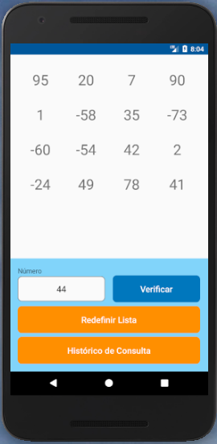
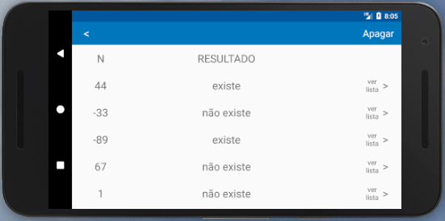
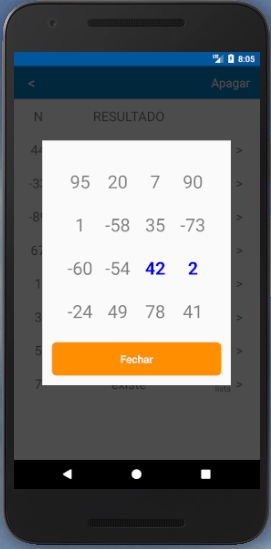

# vector

Este simples app recebe um **vetor de 16 números aleatórios** da internet e um **valor N (inteiro)** digitado pelo usuário.
Quando o usuário entra o valor N e clica em "Verificar", o app calcula se a soma de quaisquer dois números, dentre os 16 do vetor, resulta nesse valor N.
Se existe a soma, o app exibe a palavra **"existe"** e mostra ao usuário quais são esses números.
Se a soma não existe, o app exibe a mensagem **"não existe"**.
Os resultados das verificações sempre são **armazenados em um histórico** para que o usuário possa consultar no futuro.

## Screenshots

## Instruções de compilação
1. Fazer o clone desse repositório
2. Abrir o projeto com o [Android Studio 3+](https://developer.android.com/studio/?hl=pt-br)
3. Sincronizar as bibliotecas utilizadas pelo Gradle
4. Na barra de menús, selecionar Run > Run app (Shift + F10)
5. Selecionar um dispositivo real ou virtual (simulador) conectado ao computador 
6. Apertar OK

## Executando testes
1. No projeto estão incluídos **testes unitários** do núcleo que verifica as somas e retorna o resultado para o usuário. O arquivo **CheckSumUnitTest.kt** contém esses testes e pode ser executado no Android Studio. Todos os testes estão passando.
2. Já no arquivo **MainActivityTest.kt** esncontra-se um **teste instrumentado** gravado com o Espresso que passa pelo fluxo do aplicativo e verifica que não ocorrem crashes.
Ao executar o teste instrumentado é necessário um dispositivo real ou virtual conectado ao computador. O teste está ocorrendo sem crashes.

## Características técnicas

1. [**Clean Architecture**](https://link.medium.com/ZIkR8dmzOT)
1. [**Kotlin 1.3**](https://kotlinlang.org/)
1. Chamada de serviço assíncrona para recuperar o vetor da internet utilizando [**Retrofit 2**](https://square.github.io/retrofit/) e [**RxAndroid 2**](https://github.com/ReactiveX/RxAndroid)
3. Persistência do histórico em um banco de dados do dispositivo utilizando [**Realm 5**](https://realm.io/blog/realm-for-android/)
4. Tratamento de erros do banco e internet com feedback para o usuário
5. Tratamento de entradas inválidas do usuário
6. Feedback dos numeros somados para o usuário na hora da verificação e histórico
7. Uso em retrato/paisagem
8. Testes unitários [**JUnit 4**](https://junit.org/junit4/) e Instrumentados [**Espresso 3**](https://developer.android.com/training/testing/espresso/)

